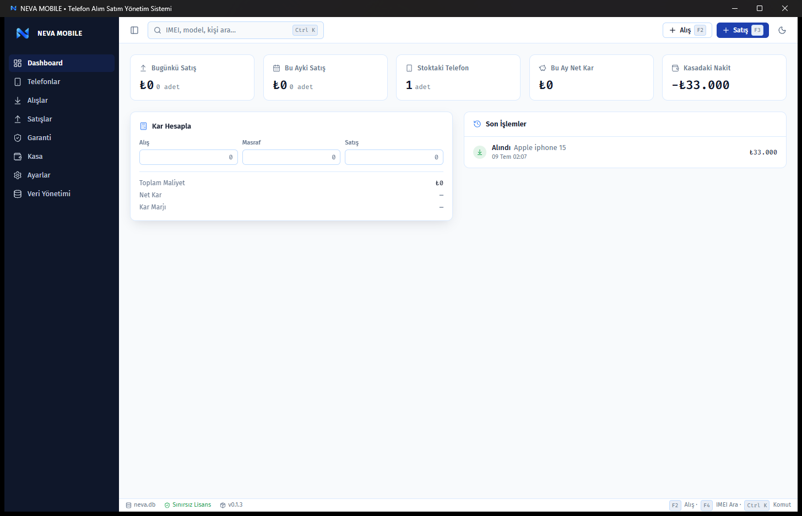
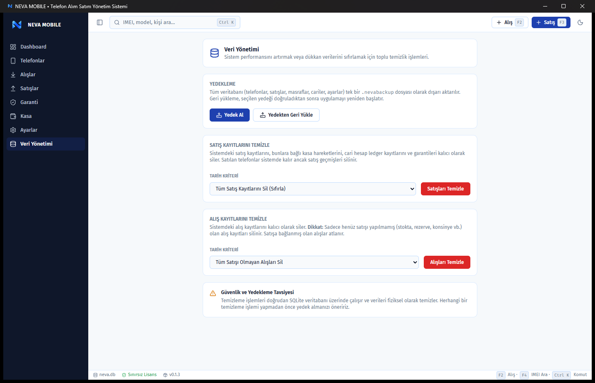
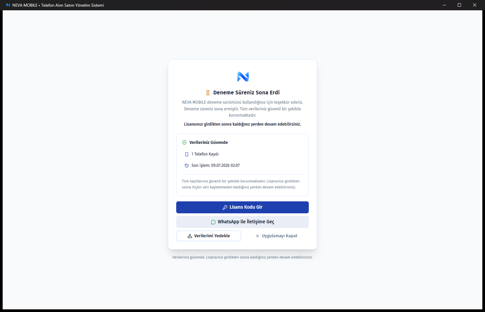

# NEVA MOBILE

**Telefoncu için geliştirildi.**
**Telefoncularla geliştiriliyor.**

 

 

 

### ⬇️ [**NEVA MOBILE Setup.exe — Son Sürümü İndir**](https://github.com/coban9066/neva-mobile/releases/latest)
Windows 10 / 11 için

### 🕰️ [**Windows 7 Legacy Edition — İndir**](https://github.com/coban9066/neva-mobile/releases/tag/legacy-win7)
Windows 7 SP1 x64 kullanan bilgisayarlar için özel sürüm

---

 

## 📓 Bir telefoncunun günü nasıl geçiyor?

Excel'de ayrı bir sayfa alış için, ayrı bir sayfa satış için. Defterde dağınık notlar. Hangi telefonun IMEI'si hangisiydi, hatırlamak zor. Garanti süresi dolmuş mu, kim takip edecek? Bir telefona ne kadar masraf gitti, kaç lira kâr kaldı — hesap kağıt üstünde, hafızada, tahminde.

**NEVA MOBILE tam olarak bu yüzden var.** Alıştan satışa, masraftan kâra, garantiden kasaya — telefoncunun tüm günlük işini tek ekranda, tek tıkla, tamamen offline toplar.

 

---

 

## ✨ Özellikler

<table>
<tr>
<td width="33%" valign="top">

**📥 Alış & Satış**
- Telefon Alış Yönetimi
- Telefon Satış Yönetimi
- 👤 Kişiler (alıcı/satıcı takibi)
- 📞 Telefon Numarası Kaydı
- IMEI Yönetimi
- Kâr Hesaplama
- 💳 POS Komisyonu Takibi
- 🧾 PDF Satış Fişi
- 💬 WhatsApp'ta Paylaş

</td>
<td width="33%" valign="top">

**🛡️ Güvence**
- Garanti Takibi
- 🧾 Telefon Bazlı Masraf Sistemi
- Kasa Yönetimi
- 🗂️ Veri Yönetimi
- Lisans Sistemi
- 📈 Dashboard Kâr Grafikleri

</td>
<td width="33%" valign="top">

**⚙️ Altyapı**
- 🔄 Otomatik Güncelleme
- SQLite Veritabanı
- 💾 Tek Dosya Yedek & Geri Yükleme
- Tamamen Offline
- Cihaza Özel Lisans
- 🕰️ Windows 7 Legacy Desteği

</td>
</tr>
</table>

 

## 🚀 Özelliklere Yakından Bakış

**📥 Telefon Alış**
Telefonları saniyeler içinde sisteme ekleyin. Alış fiyatı, IMEI, depolama, kozmetik ve garanti bilgilerini tek ekrandan yönetin.

**💰 Telefon Satış**
Satılan telefonlar otomatik olarak stoktan düşer, kâr hesabı otomatik yapılır. Geçmiş satış kayıtlarına istediğiniz an ulaşırsınız.

**🧾 Telefon Bazlı Masraf**
Kargo, bakım, ekran değişimi, işçilik — her telefona istediğiniz masrafı ekleyin, gerçek maliyetinizi görün.

**💬 WhatsApp Paylaşımı**
Tek tıkla WhatsApp'ta paylaşın. Model, depolama, kozmetik, pil sağlığı, menşei ve fiyat otomatik hazırlanır.

**👤 Kişiler Sekmesi**
Her telefonun detayında yeni bir "Kişiler" sekmesi: telefonu **kimden aldığınız** ve (satıldıysa) **kime sattığınız** bilgisi ad, telefon numarası ve tarihle birlikte tek yerde görünür. Bilgileri buradan düzenleyebilir, telefon numarasının yanındaki butonla ilgili kişiyle **tek tıkla WhatsApp** sohbeti açabilirsiniz. Ayrı bir rehber/CRM tutmanıza gerek yok — numara doğrudan alış/satış kaydında saklanır.

**📞 Telefon Numarası Kaydı**
Alış ("Kimden Alındı") ve satış ("Kime Satıldı") ekranlarına opsiyonel telefon numarası alanı eklendi. `0532 123 45 67` gibi girin; sistem otomatik biçimlendirir ve saklar. Boş bırakmak serbest.

**💳 POS Komisyonu Takibi**
Satışta ödeme türü POS seçildiğinde banka komisyonunu yüzde (%) veya sabit tutar (₺) olarak girin. Kasaya gerçekte giren tutar ve net kârınız komisyon düşülerek otomatik hesaplanır — elle çıkarma yapmanıza gerek kalmaz.

**🧾 PDF Satış Fişi**
Tamamlanan her satış için tek tıkla modern tasarımlı bir PDF fiş oluşturun: telefon modeli, IMEI, satış tarihi, fiyat, ödeme türü, komisyon ve garanti bilgisi tek sayfada. İstediğiniz konuma kaydedip müşterinize verebilirsiniz.

**📈 Dashboard Kâr Grafikleri**
Ana ekranda son 12 ayın kârını sütun grafikte, bu ayın günlük kâr seyrini çizgi grafikte görün. Ayrıca toplam telefon sayısı, toplam kâr, bekleyen garanti adedi ve en çok satılan markanız tek bakışta karşınızda.

**🛡️ Garanti Takibi**
Satılan telefonların garanti süresini, başlangıç ve bitiş tarihlerini kolayca takip edin.

**📊 Kasa Yönetimi**
Toplam alış, satış, kâr ve gider bilgilerinizi tek ekranda görün.

**📂 Veri Yönetimi**
Tüm veritabanınız (telefonlar, satışlar, masraflar, cariler, ayarlar) tek bir `.nevabackup` dosyası olarak istediğiniz konuma yedeklenir. Geri yüklemede dosya önce doğrulanır — bozuk dosyalar reddedilir, verileriniz risk altına girmez.

**🔑 Güven Veren Lisans Deneyimi**
Deneme süresi dolduğunda verileriniz asla silinmez. "Verileriniz Güvende" ekranı kayıtlarınızın özetini canlı gösterir; lisansınızı girdiğiniz an kaldığınız yerden devam edersiniz. Lisanssızken bile yedek alabilirsiniz.

**🕰️ Windows 7 Legacy Edition**
Dükkânında hâlâ Windows 7 kullanan esnaf unutulmadı: Windows 7 SP1 x64 için özel derlenen ayrı paket, WebView2 Runtime 109 ile birlikte gelir ve kendi bağımsız güncelleme kanalını kullanır. Aynı veritabanı yapısı sayesinde Windows 10'a geçişte verileriniz tek dosyayla taşınır.

**🔄 Otomatik Güncelleme**
Yeni sürüm çıktığında uygulama otomatik algılar, tekrar kurulum yapmadan tek tıkla güncellersiniz. Verileriniz korunur.

**🔒 Offline Çalışma**
Tüm veriler bilgisayarınızda saklanır. İnternet olmasa da çalışmaya devam eder.

**💳 Lisans Sistemi**
Tek seferlik lisansla süresiz kullanın. Bilgisayar değiştirirseniz lisans transferi yapılır.

 

## 🎯 Kimler İçin?

| 📱 Telefon Alım Satım Mağazaları | 🏪 GSM Bayileri | ♻️ İkinci El Satıcıları | 💼 Telefon Ticareti Yapan İşletmeler |
|:---:|:---:|:---:|:---:|

 

---

 

## 📸 Uygulamadan Görüntüler

Gerçek ekranlar, gerçek akış — NEVA MOBILE'ın günlük kullanımda nasıl göründüğü.

<table>
<tr>
<td align="center" width="33%">

 <b>Telefon Alış</b>
</td>
<td align="center" width="33%">

 <b>Telefon Detayı</b>
</td>
<td align="center" width="33%">

 <b>Satış</b>
</td>
</tr>
<tr>
<td align="center" width="33%">

 <b>Dashboard</b>
</td>
<td align="center" width="33%">

 <b>Veri Yönetimi — Yedekleme</b>
</td>
<td align="center" width="33%">

 <b>Lisans Ekranı — Verileriniz Güvende</b>
</td>
</tr>
<tr>
<td align="center" width="33%">

 <b>Garanti</b>
</td>
<td align="center" width="33%">

 <b>Kasa</b>
</td>
<td align="center" width="33%">

 <b>WhatsApp Paylaşımı</b>
</td>
</tr>
</table>

 

---

 

## 🆚 Neden NEVA MOBILE?

| | 📊 Excel / Defter | ✅ NEVA MOBILE |
|---|:---:|:---:|
| IMEI Takibi | ✗ | ✓ |
| Garanti Takibi | ✗ | ✓ |
| Otomatik Kâr Hesabı | ✗ | ✓ |
| Kasa Yönetimi | Manuel | ✓ Otomatik |
| Telefon Bazlı Masraf Sistemi | Dağınık | ✓ Her Telefonda Ayrı |
| WhatsApp'ta Paylaşım | ✗ | ✓ Tek Tık |
| Otomatik Güncelleme | ✗ | ✓ |
| Veri Yönetimi / Yedekleme | ✗ | ✓ |
| Offline Çalışma | ✓ | ✓ |
| Lisans / Cihaz Güvenliği | ✗ | ✓ |
| Telefoncuya Özel Tasarım | ✗ | ✓ |

 

---

 

## 🖥️ Desteklenen İşletim Sistemleri ve Kurulum

| | Standart Sürüm | Windows 7 Legacy Edition |
|---|:---:|:---:|
| **İşletim Sistemi** | Windows 10 (1803+) / Windows 11 | Windows 7 SP1 x64 |
| **İndirilecek Dosya** | `NEVA MOBILE Setup.exe` | `NEVA MOBILE Win7 Setup.exe` |
| **WebView2** | Otomatik (sistemde hazır) | Runtime 109 pakette gelir |
| **Otomatik Güncelleme** | ✓ (standart kanal) | ✓ (ayrı legacy kanalı) |
| **Veritabanı & Lisans** | Aynı | Aynı — Win10'a geçişte tek dosyayla taşınır |

**Kurulum:** İndirdiğiniz Setup dosyasını çift tıklayın → kurulum bitince uygulamayı açın → ilk açılışta görünen **Cihaz Kimliği**'ni satıcınıza gönderin → size verilen lisans kodunu yapıştırın. Hepsi bu.

> **Windows 7 notu:** Legacy paketi kurmadan önce Windows 7 SP1 ve güncel Windows Update'lerin (özellikle SHA-2 desteği) kurulu olduğundan emin olun. `WebView2Runtime109-x64.exe` dosyası Setup ile aynı klasörde olmalıdır — WebView2 kurulu değilse kurulum bunu otomatik çalıştırır.

 

---

 

## 🔒 Neden Offline?

> Verileriniz bilgisayarınızdan **hiç çıkmaz.**

- ✔ Hiçbir sunucuya veri gönderilmez
- ✔ Hiçbir bulut hesabı gerekmez
- ✔ İnternet olmasa bile tam performansla çalışır
- ✔ Stok listeniz, müşteri bilgileriniz yalnızca size ait

 

---

 

## 🔄 Otomatik Güncelleme

**Yeni sürüm çıktığında NEVA MOBILE bunu otomatik algılar.**
**Tek tıkla günceller. Tekrar indirmenize gerek kalmaz.**

✔ Veritabanınız korunur &nbsp;·&nbsp; ✔ Lisansınız korunur &nbsp;·&nbsp; ✔ Ayarlarınız korunur

 

---

 

## 💳 Lisans

### Tek Sefer Ödeme

✔ Süresiz Kullanım &nbsp;·&nbsp; ✔ Ücretsiz Güncellemeler &nbsp;·&nbsp; ✔ Lisans Transferi &nbsp;·&nbsp; ✔ Tamamen Offline

 

> 🧑‍🤝‍🧑 **50'den fazla telefoncu tarafından test edilmeye başlandı.** Gelen geri bildirimlerle sürekli geliştiriliyor.

 

---

 

## 🚀 Deneme Sürümü

**Hemen indirin, kurun ve bir mesaj uzağınızda olan deneme lisansıyla test etmeye başlayın.**

### 📩 Instagram'dan yazın → [@prodbycoban](https://instagram.com/prodbycoban)

 

---

 

## ❓ Sık Sorulan Sorular

<b>Program internet ister mi?</b>

 
Hayır. NEVA MOBILE tamamen offline çalışır. İnternet yalnızca otomatik güncelleme kontrolü için (isteğe bağlı) kullanılır.

<b>Verilerim nerede tutuluyor? Bana mı ait?</b>

 
Sizin bilgisayarınızda, kendi veritabanınızda. Başka kimse göremiyor, hiçbir sunucuya gönderilmiyor. Veriler tamamen size aittir.

<b>Yedek nasıl alınır?</b>

 
Veri Yönetimi ekranındaki <b>Yedek Al</b> butonuyla tüm veritabanınız tek bir <code>.nevabackup</code> dosyası olarak istediğiniz konuma kaydedilir. <b>Yedekten Geri Yükle</b> ile de aynı dosyadan verilerinizi geri getirirsiniz — dosya önce doğrulanır, bozuksa reddedilir.

<b>Deneme sürem bitince verilerim silinir mi?</b>

 
Hayır, kesinlikle silinmez. Deneme süresi dolduğunda karşınıza verilerinizin özetini gösteren bir bilgi ekranı çıkar; lisansınızı girdiğiniz an kaldığınız yerden devam edersiniz. Bu ekrandayken bile yedek alabilirsiniz.

<b>Windows 7 kullanıyorum, çalışır mı?</b>

 
Evet — Windows 7 SP1 x64 için özel hazırlanan <b>Legacy Edition</b> paketini indirin. WebView2 Runtime 109 pakette birlikte gelir. Veritabanı yapısı standart sürümle aynıdır; ileride Windows 10'a geçerseniz verileriniz tek yedek dosyasıyla taşınır.

<b>Bilgisayarımı formatlarsam veya değiştirirsem ne olur?</b>

 
Düzenli aldığınız yedeği yeni bilgisayarınızda geri yükleyebilirsiniz. Lisansınız da cihaz transferiyle yeni bilgisayara taşınabilir.

<b>Güncellemeler ücretsiz mi?</b>

 
Evet. Lisansınız aktif olduğu sürece tüm güncellemeler ücretsizdir.

<b>Lisans başka bir bilgisayara taşınabilir mi?</b>

 
Evet — lisans transferi desteklenir.

 

---

 

## 💬 Geri Bildirim

Hata bildirimi, öneriler ve yeni özellik talepleri:

**[@prodbycoban](https://instagram.com/prodbycoban)**

 

---

### NEVA MOBILE

Telefoncu için geliştirildi.
Telefoncularla geliştiriliyor.

📩 [Instagram — @prodbycoban](https://instagram.com/prodbycoban) &nbsp;·&nbsp; 💻 [GitHub](https://github.com/coban9066/neva-mobile) &nbsp;·&nbsp; ⬇️ [Release](https://github.com/coban9066/neva-mobile/releases/latest)

© 2026 NEVA MOBILE

