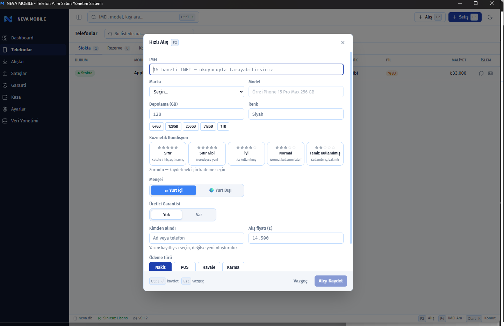
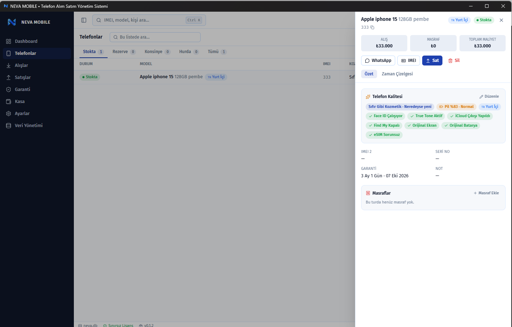
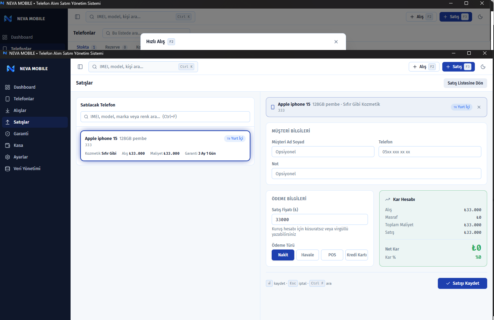
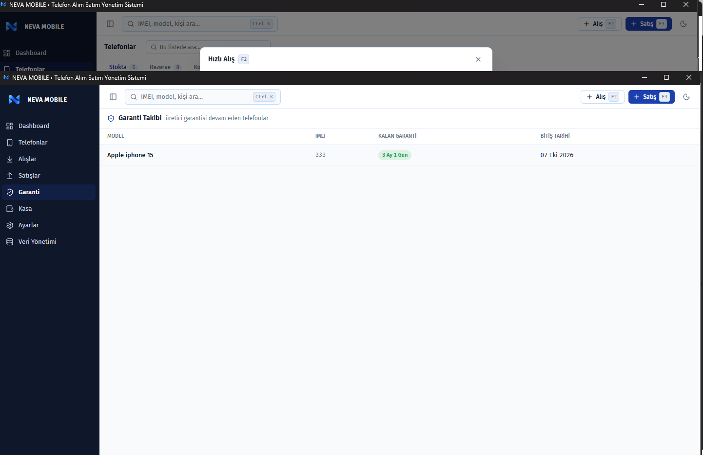
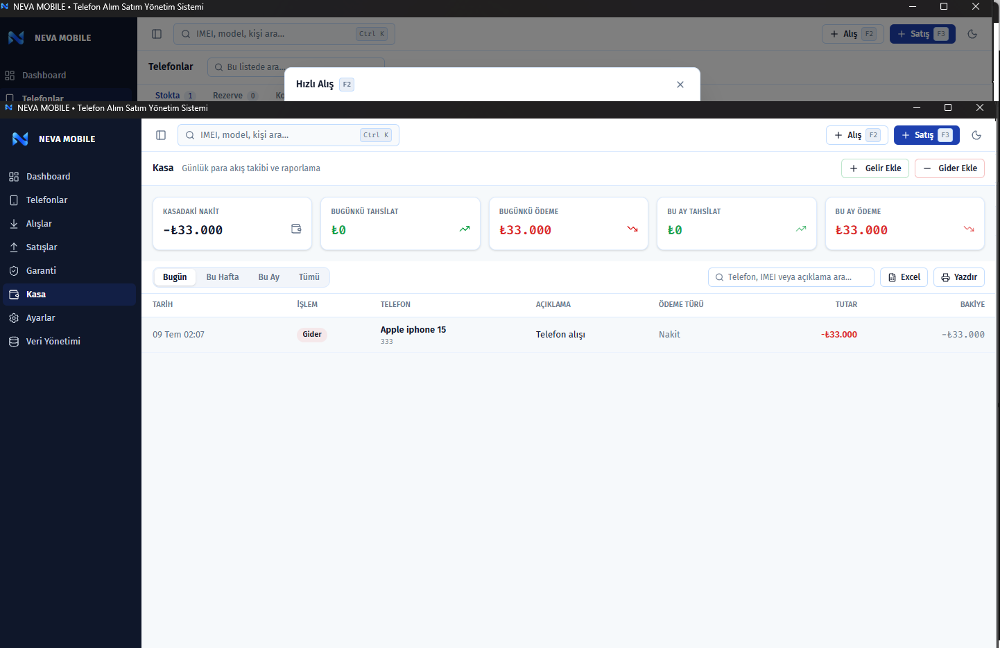
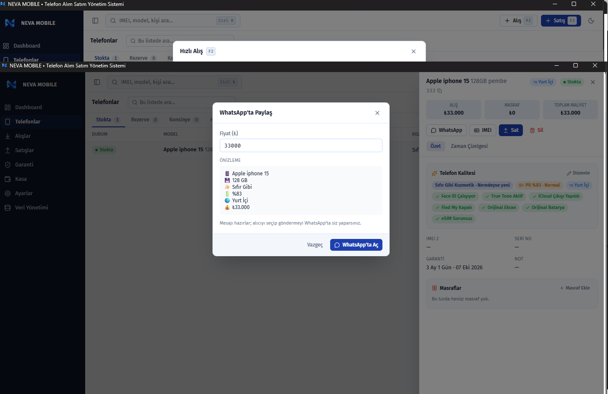

# NEVA MOBILE

**Telefoncu için geliştirildi.**
**Telefoncularla geliştiriliyor.**

 

 

 

### ⬇️ [**NEVA MOBILE Setup.exe — Son Sürümü İndir**](https://github.com/coban9066/neva-mobile/releases/latest)

---

 

## 📓 Bir telefoncunun günü nasıl geçiyor?

Excel'de ayrı bir sayfa alış için, ayrı bir sayfa satış için. Defterde dağınık notlar. Hangi telefonun IMEI'si hangisiydi, hatırlamak zor. Garanti süresi dolmuş mu, kim takip edecek? Bir telefona ne kadar masraf gitti, kaç lira kâr kaldı — hesap kağıt üstünde, hafızada, tahminde.

**NEVA MOBILE tam olarak bu yüzden var.** Alıştan satışa, masraftan kâra, garantiden kasaya — telefoncunun tüm günlük işini tek ekranda, tek tıkla, tamamen offline toplar.

 

---

 

## ✨ Özellikler

<table>
<tr>
<td width="33%" valign="top">

**📥 Alış & Satış**
- Telefon Alış Yönetimi
- Telefon Satış Yönetimi
- IMEI Yönetimi
- Kâr Hesaplama
- 💬 WhatsApp'ta Paylaş

</td>
<td width="33%" valign="top">

**🛡️ Güvence**
- Garanti Takibi
- 🧾 Telefon Bazlı Masraf Sistemi
- Kasa Yönetimi
- 🗂️ Veri Yönetimi
- Lisans Sistemi

</td>
<td width="33%" valign="top">

**⚙️ Altyapı**
- 🔄 Otomatik Güncelleme
- SQLite Veritabanı
- Tamamen Offline
- Cihaza Özel Lisans

</td>
</tr>
</table>

 

## 🎯 Kimler İçin?

| 📱 Telefon Alım Satım Mağazaları | 🏪 GSM Bayileri | ♻️ İkinci El Satıcıları | 💼 Telefon Ticareti Yapan İşletmeler |
|:---:|:---:|:---:|:---:|

 

---

 

## 📸 Uygulamadan Görüntüler

Gerçek ekranlar, gerçek akış — NEVA MOBILE'ın günlük kullanımda nasıl göründüğü.

<table>
<tr>
<td align="center" width="33%">

 <b>Telefon Alış</b>
</td>
<td align="center" width="33%">

 <b>Telefon Detayı</b>
</td>
<td align="center" width="33%">

 <b>Satış</b>
</td>
</tr>
<tr>
<td align="center" width="33%">

 <b>Garanti</b>
</td>
<td align="center" width="33%">

 <b>Kasa</b>
</td>
<td align="center" width="33%">

 <b>WhatsApp Paylaşımı</b>
</td>
</tr>
</table>

 

---

 

## 🆚 Neden NEVA MOBILE?

| | 📊 Excel / Defter | ✅ NEVA MOBILE |
|---|:---:|:---:|
| IMEI Takibi | ✗ | ✓ |
| Garanti Takibi | ✗ | ✓ |
| Otomatik Kâr Hesabı | ✗ | ✓ |
| Kasa Yönetimi | Manuel | ✓ Otomatik |
| Telefon Bazlı Masraf Sistemi | Dağınık | ✓ Her Telefonda Ayrı |
| WhatsApp'ta Paylaşım | ✗ | ✓ Tek Tık |
| Otomatik Güncelleme | ✗ | ✓ |
| Veri Yönetimi / Yedekleme | ✗ | ✓ |
| Offline Çalışma | ✓ | ✓ |
| Lisans / Cihaz Güvenliği | ✗ | ✓ |
| Telefoncuya Özel Tasarım | ✗ | ✓ |

 

---

 

## 🔒 Neden Offline?

> Verileriniz bilgisayarınızdan **hiç çıkmaz.**

- ✔ Hiçbir sunucuya veri gönderilmez
- ✔ Hiçbir bulut hesabı gerekmez
- ✔ İnternet olmasa bile tam performansla çalışır
- ✔ Stok listeniz, müşteri bilgileriniz yalnızca size ait

 

---

 

## 🔄 Otomatik Güncelleme

**Yeni sürüm çıktığında NEVA MOBILE bunu otomatik algılar.**
**Tek tıkla günceller. Tekrar indirmenize gerek kalmaz.**

✔ Veritabanınız korunur &nbsp;·&nbsp; ✔ Lisansınız korunur &nbsp;·&nbsp; ✔ Ayarlarınız korunur

 

---

 

## 💳 Lisans

### Tek Sefer Ödeme

✔ Süresiz Kullanım &nbsp;·&nbsp; ✔ Ücretsiz Güncellemeler &nbsp;·&nbsp; ✔ Lisans Transferi &nbsp;·&nbsp; ✔ Tamamen Offline

 

> 🧑‍🤝‍🧑 **50'den fazla telefoncu tarafından test edilmeye başlandı.** Gelen geri bildirimlerle sürekli geliştiriliyor.

 

---

 

## 🚀 Deneme Sürümü

**Hemen indirin, kurun ve bir mesaj uzağınızda olan deneme lisansıyla test etmeye başlayın.**

### 📩 Instagram'dan yazın → [@prodbycoban](https://instagram.com/prodbycoban)

 

---

 

## ❓ Sık Sorulan Sorular

<b>Program internet ister mi?</b>

 
Hayır. NEVA MOBILE tamamen offline çalışır. İnternet yalnızca otomatik güncelleme kontrolü için (isteğe bağlı) kullanılır.

<b>Verilerim nerede tutuluyor? Bana mı ait?</b>

 
Sizin bilgisayarınızda, kendi veritabanınızda. Başka kimse göremiyor, hiçbir sunucuya gönderilmiyor. Veriler tamamen size aittir.

<b>Yedek nasıl alınır?</b>

 
Ayarlar > Veri Yönetimi ekranından tek tıkla yedek alabilirsiniz.

<b>Bilgisayarımı formatlarsam veya değiştirirsem ne olur?</b>

 
Düzenli aldığınız yedeği yeni bilgisayarınızda geri yükleyebilirsiniz. Lisansınız da cihaz transferiyle yeni bilgisayara taşınabilir.

<b>Güncellemeler ücretsiz mi?</b>

 
Evet. Lisansınız aktif olduğu sürece tüm güncellemeler ücretsizdir.

<b>Lisans başka bir bilgisayara taşınabilir mi?</b>

 
Evet — lisans transferi desteklenir.

 

---

 

## 💬 Geri Bildirim

Hata bildirimi, öneriler ve yeni özellik talepleri:

**[@prodbycoban](https://instagram.com/prodbycoban)**

 

---

### NEVA MOBILE

Telefoncu için geliştirildi.
Telefoncularla geliştiriliyor.

📩 [Instagram — @prodbycoban](https://instagram.com/prodbycoban) &nbsp;·&nbsp; 💻 [GitHub](https://github.com/coban9066/neva-mobile) &nbsp;·&nbsp; ⬇️ [Release](https://github.com/coban9066/neva-mobile/releases/latest)

© 2026 NEVA MOBILE

