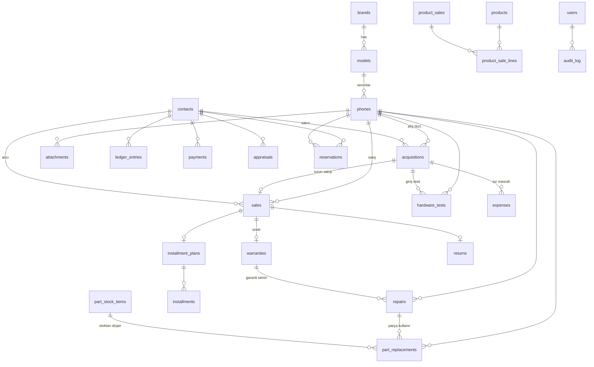

# 02 — Veritabanı Mimarisi (SQLite)

## 0. Genel Kurallar

- **Para:** tüm tutarlar `INTEGER` **kuruş**. Gerekçe: REAL yuvarlama hatası muhasebede kabul edilemez.
- **Tarih:** `TEXT` ISO-8601 (`2026-07-07T14:30:00`), UTC değil yerel saat (offline tek cihaz).
- **Silme:** soft delete → `deleted_at TEXT NULL`. Fiziksel silme yok.
- **Kimlikler:** `INTEGER PRIMARY KEY` (rowid). IMEI doğal anahtar değil; UNIQUE kısıt.
- **Zaman çizelgesi:** ayrı tablo yok; olay tablolarının UNION view'i (`v_phone_timeline`).
- **FTS:** `search_index` (FTS5) — IMEI, model, kişi adı, notlar.
- **Migration:** `schema_version` tablosu + sıralı migration dosyaları.

## 1. Tablolar

### 1.1 Katalog

```
brands        id, name UNIQUE, sort_order
models        id, brand_id FK, name, default_ram, default_storage_options(JSON), sort_order
              UNIQUE(brand_id, name)
```
Gerekçe: Serbest metin marka/model rapor kırılımını öldürür ("iphone 13" ≠ "iPhone13"). Katalog + otomatik tamamlama ile tutarlılık.

### 1.2 Telefon (varlık)

```
phones
  id, imei1 TEXT UNIQUE NOT NULL, imei2 TEXT NULL,
  brand_id FK, model_id FK, color, storage_gb INT, ram_gb INT,
  serial_no, cosmetic_grade TEXT CHECK(A|B|C|D),
  battery_health INT, battery_cycles INT,
  ownership TEXT CHECK(stock|customer|consignment) DEFAULT stock,
  status TEXT CHECK(appraisal|in_stock|reserved|sold|in_repair|returned|scrap|consigned) ,
  current_acquisition_id FK NULL,   -- aktif tur
  notes, created_at, updated_at, deleted_at
```
Gerekçe: `status` tek state machine; `ownership` müşteri cihazını stok raporlarından ayırır; `current_acquisition_id` aktif turu (kar hesabı kapsamını) işaretler.

### 1.3 Kişiler (Cari)

```
contacts
  id, type TEXT CHECK(customer|supplier|both),
  full_name, phone_number, tc_no_encrypted TEXT NULL, address, notes,
  id_photo_path TEXT NULL,          -- KVKK: şifreli klasörde
  created_at, updated_at, deleted_at
```
Gerekçe: Telefoncuda aynı kişi hem satıcı hem alıcıdır → tek tablo, `type=both`. TC no şifreli saklanır, UI'da maskeli, yetkiyle açılır.

### 1.4 Alış / Satış (turlar)

```
acquisitions                       -- alış = tur başlangıcı
  id, phone_id FK, contact_id FK, date,
  price INT, payment_method TEXT CHECK(cash|pos|transfer|mixed),
  source TEXT CHECK(walk_in|trade_in|wholesale|return|appraisal),
  trade_in_sale_id FK NULL,        -- takasla geldiyse bağlı satış
  notes, created_by FK users, created_at, deleted_at

sales
  id, phone_id FK, acquisition_id FK, contact_id FK, date,
  price INT, payment_method, 
  trade_in_acquisition_id FK NULL, -- takasla alınan telefonun alışı
  installment_plan_id FK NULL,
  notes, created_by, created_at, deleted_at
```
Gerekçe: Satış `acquisition_id` taşır → kar her zaman doğru tura bağlanır. Takas çift yönlü FK ile tek işlemde iki kaydı bağlar.

### 1.5 Donanım Testleri (girişe bağlı)

```
hardware_tests
  id, phone_id FK, acquisition_id FK NULL, repair_id FK NULL,
  test_type TEXT (face_id|touch_id|true_tone|wifi|bluetooth|gps|nfc|sim|
                  speaker|mic|vibration|proximity|light_sensor|charging|
                  front_camera|rear_camera|flash),
  result TEXT CHECK(ok|issue|fail),
  note, tested_at
```
Gerekçe: Test bir girişin fotoğrafıdır; `acquisition_id` (alışta) veya `repair_id` (tamir sonrası) bağlamı verir. İki giriş arasındaki fark raporlanabilir.

### 1.6 Parça Değişimi & Masraf

```
part_replacements
  id, phone_id FK, acquisition_id FK, repair_id FK NULL,
  part_type TEXT (screen|battery|back_glass|housing|camera|charging_port|
                  speaker|mic|motherboard|face_id|touch_id),
  quality TEXT CHECK(original|aftermarket|refurbished),
  part_stock_item_id FK NULL,      -- parça stoğundan düştüyse
  cost INT, date, note

expenses
  id, phone_id FK, acquisition_id FK,
  category TEXT (screen|battery|repair|labor|shipping|other),
  description, amount INT, date, is_warranty_cost BOOL DEFAULT 0,
  created_by, deleted_at
```
Gerekçe: Maliyet = `acquisitions.price + SUM(expenses WHERE acquisition_id = tur)`. Parça değişimi hem teknik geçmiş (kalite) hem masraf üretir; `is_warranty_cost` garanti giderini karda ayrı gösterir.

### 1.7 Tamir

```
repairs
  id, phone_id FK, contact_id FK NULL,   -- müşteri tamiri ise sahip
  kind TEXT CHECK(internal|customer|warranty),
  warranty_id FK NULL,
  problem, diagnosis,
  status TEXT CHECK(received|diagnosing|waiting_part|repairing|done|delivered|cancelled),
  labor_price INT, quoted_price INT, final_price INT,
  received_at, promised_at, delivered_at,
  created_by, deleted_at
```
Gerekçe: Üç tamir türü ayrışır — `internal` (stok telefonu yenileme, masrafa gider), `customer` (gelir kalemi), `warranty` (garanti gideri). `promised_at` teslim sözü takibi dashboard uyarısı üretir.

### 1.8 Garanti

```
warranties
  id, sale_id FK UNIQUE, type TEXT (store|import|apple_tr|none),
  months INT, start_date, end_date, terms, voided_at NULL
```
Durum ve kalan gün **türetilir** (`end_date - today`), kolonda tutulmaz.
Gerekçe: Satışa bağlı (telefona değil) → her satış turu kendi garantisini taşır.

### 1.9 Cari Defter & Ödemeler

```
ledger_entries                     -- tek doğruluk kaynağı: cari bakiye
  id, contact_id FK, date,
  ref_type TEXT (acquisition|sale|payment|return|repair|consignment|adjustment),
  ref_id INT, debit INT, credit INT, note, created_by

payments
  id, contact_id FK, date, amount INT, direction TEXT CHECK(in|out),
  method TEXT (cash|pos|transfer), installment_id FK NULL, note

installment_plans
  id, sale_id FK, total INT, down_payment INT, installment_count INT
installments
  id, plan_id FK, seq INT, due_date, amount INT, paid_payment_id FK NULL
```
Gerekçe: Bakiye asla kolonda tutulmaz; `SUM(credit) - SUM(debit)` her zaman doğrudur. Taksitler vade tarihli satırlar → geciken taksit sorgusu trivial.

### 1.10 Kasa

```
till_entries
  id, date, direction TEXT CHECK(in|out),
  method TEXT (cash|pos|transfer),
  amount INT, ref_type, ref_id, note, created_by

till_closures
  id, date UNIQUE, expected_cash INT, counted_cash INT, difference INT,
  pos_total INT, transfer_total INT, note, closed_by, closed_at
```
Gerekçe: Her parasal olay kasaya satır atar; gün sonu sayım `till_closures`'a yazılır, fark görünür.

### 1.11 Yan Stoklar

```
part_stock_items    id, name, part_type, quality, compatible_models(JSON), qty INT, avg_cost INT, sell_price INT
products            id, sku UNIQUE, name, category(case|charger|cable|headphone|other), qty INT, avg_cost INT, sell_price INT, barcode
product_sales       id, date, contact_id NULL, total INT, payment_method, created_by
product_sale_lines  id, product_sale_id FK, product_id FK, qty, unit_price INT
stock_movements     id, item_kind TEXT(part|product), item_id, delta INT, reason(purchase|sale|repair_use|adjustment|scrap_harvest), ref_id, date
```
Gerekçe: Aksesuar/parça adetli ürünlerdir, telefonla aynı modele sığmaz. `stock_movements` her adet değişiminin denetim izidir; hurda hasadı (`scrap_harvest`) parça stoğunu besler.

### 1.12 Ekspertiz, Rezervasyon, İade

```
appraisals    id, contact_id NULL, phone_id FK NULL, brand_id, model_id, storage_gb,
              cosmetic_grade, offered_price INT, asked_price INT,
              result TEXT CHECK(pending|bought|declined), date, note
reservations  id, phone_id FK, contact_id FK, deposit INT, until_date,
              status CHECK(active|completed|cancelled|expired), created_at
returns       id, kind CHECK(sale_return|purchase_return), sale_id FK NULL,
              acquisition_id FK NULL, date, reason,
              refund_amount INT, restock BOOL, note, created_by
```
Gerekçe: Ekspertiz reddi bile veri — kişi geri geldiğinde teklif geçmişi ekranda. Rezervasyon `phones.status=reserved` geçişini tetikler.

### 1.13 Sistem

```
users        id, username UNIQUE, password_hash(argon2), display_name,
             role CHECK(owner|manager|staff), is_active, created_at
permissions  role bazlı sabit matris (kod tarafında); kritik bayraklar:
             see_purchase_price, see_profit, delete_records, close_till, manage_users
audit_log    id, user_id, action, entity, entity_id, before(JSON), after(JSON), at
settings     key PK, value(JSON)   -- dükkân adı, para birimi, garanti varsayılanı,
                                   -- yedek klasörü, etiket şablonu, tema
license      device_id, license_key, plan, expires_at, signature,
             last_seen_clock       -- saat geri alma koruması
attachments  id, entity TEXT(phone|contact|repair), entity_id, kind(photo|id_scan|receipt),
             path, created_at
backups      id, path, size, created_at, kind(auto|manual), checksum
schema_version  version INT
```

### 1.14 Arama

```
search_index (FTS5)
  content: imei1, imei2, serial_no, brand+model, contact adları, telefon no, notlar
  trigger'larla senkron
```

## 2. Türetilmiş Görünümler (View)

```
v_phone_timeline      -- alış ∪ satış ∪ tamir ∪ masraf ∪ parça ∪ iade ∪ rezervasyon
                      -- (phone_id, date, event_type, title, amount, ref_type, ref_id)
v_phone_cost          -- tur bazlı: alış + masraflar = toplam maliyet
v_phone_profit        -- tur bazlı: satış − maliyet = net kar
v_contact_balance     -- SUM(credit)-SUM(debit) per contact
v_stock_value         -- status=in_stock ∧ ownership=stock: SUM(maliyet)
v_stock_aging         -- stoktaki gün sayısı + 30/60/90 kovaları
v_warranty_active     -- end_date >= today, kalan gün
v_overdue_installments, v_overdue_repairs (promised_at geçmiş)
```
Gerekçe: Tüm dashboard ve raporlar view'lerden okur; iş kuralı tek yerde yaşar.

## 3. Entity İlişki Diyagramı



## 4. Kritik İndeksler

```
phones(imei1) UNIQUE, phones(status), phones(model_id)
acquisitions(phone_id, date), sales(phone_id, date), sales(date)
expenses(acquisition_id), ledger_entries(contact_id, date)
installments(due_date) WHERE paid_payment_id IS NULL
repairs(status), till_entries(date), stock_movements(item_kind, item_id)
```

## 5. Veri Bütünlüğü Kuralları (uygulama katmanı)

1. IMEI Luhn doğrulaması + 15 hane kontrolü; `imei2` girildiyse `imei1 ≠ imei2`.
2. Aynı telefonda kapatılmamış tur varken yeni alış açılamaz (önce satış/iade/hurda).
3. `status=sold` telefona satış girilemez; `reserved` telefon satılırken rezervasyon otomatik `completed`.
4. Satış silinirse (soft) bağlı garanti `voided`, ledger ters kayıtla düzeltilir — asla satır silinmez.
5. Tüm para hareketleri aynı transaction içinde: satış = `sales` + `ledger` + `till` + (varsa) `installments` atomik yazılır.
